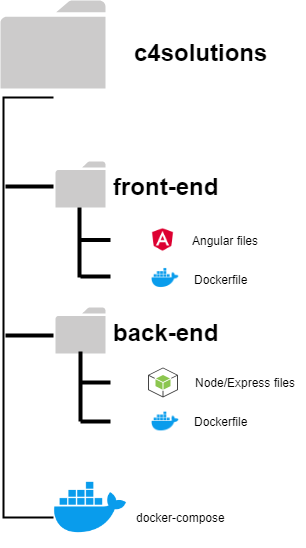

# About

## Installation setup for the project
1. Clone this repo. ``` git clone https://github.com/C4SolutionsTDDC88/c4solutions.git ```
2. Go into local repo. ``` cd c4solutions ```
3. Clone front-end-repo. ``` git clone https://github.com/C4SolutionsTDDC88/front-end.git ```
4. Clone back-end-repo. ``` git clone https://github.com/C4SolutionsTDDC88/back-end.git ```

## File structure for the project


# Start development server
**To be able to run the development environment one most have docker server installed and running.**
1. In a terminal see that c4solutions is your current working directory.
2. Run the command  ``` npm run start ```.

**NOTE:** At the first executing docker will need to download a lot of data. Therefore this can take up to five minutes depending on your internet speed.

## The cache in Docker
If the docker environment fails to find modules and crashes, the fault may lie with the caching in docker. To ensure this is not the problem, run the following command:
1. ```npm run docker:clean```

# Deployment on a server

## Prerequisites on the server environment
All the prerequisites have been fetch with sudo apt-get <package-name>

1. Docker
2. Docker-compose
3. Node
4. Nginx (For this example we have used nginx for outside port handling)

## Setup environment

1. Copy the config file ```ngnix/example-config``` to ```/etc/nginx/sites-enabled``` destination on the server. (Make sure the default config in ```/etc/nginx/sites-enabled``` is removed).
2. To adjust the ports used in the project, adjust variables in ```.env``` in this repository to adjust the backend ports, and ```frontend/src/environments``` to desired backend API url.
3. Attach wanted database to the folder ```db_data/c4db``` in this repository, if the database does not exist, the init script ```init-db/init.sql``` will executed to populate a mockdatabase.

## Deployment
1. Use git to fetch the frontend, backend, and this repository according the the filestructre above, by using ```git clone```
2. Use ```cd front-end``` and run ```npm install``` and then ```npm run build:prod```, This will package the front-end as a static file, which will in later steps be hosted from the backend. It is also possible to run the ```deploy.sh``` script to do these described steps.
3. Stand in the ```c4solutions``` directory and run ```docker-compose -f docker-compose.prod.yml up --build```, add the flag ```-d``` to run the service dettached. Alternativly run the command ```npm run deploy``` from the ```c4solutions``` directory.
4. run ```sudo service nginx reload``` to reload ngnix, this step isn't always necessary.

### Docker cache
Sometimes docker caches and doesn't update wanted changes. Run the command ```npm run docker:clean``` to remove all images and volumes stored in docker.

### Explanation of the flow
While developing the application the front-end and back-end are hosted as two different services, meanwhile in production the front-end is hosted from the same service as the back-end application. The database is always hosted as an independent service. To describe the deployment steps in a more general fashion, we build the front-end as a static application and later during the docker build copy over the static front-end files to the back-end service deployed. So only two docker containers are running while in production meanwhile 3 are running when developing the application. 

## Testing

### Back-end testing - Integration tests
1. In a terminal see that c4solutions is your current working directory
2. Run ```npm run test:backend``` to start back-end tests

### Front-end testing - E2E tests
1. In a terminal see that c4solutions is your current working directory
2. Go into front-end repo ```cd front-end```
3. Go into test folder ```cd test```
4. Run ```npm install```
5. Go back to c4solutions directory ```cd ../..```
6. Run ```npm run test:e2e``` to start front-end tests

